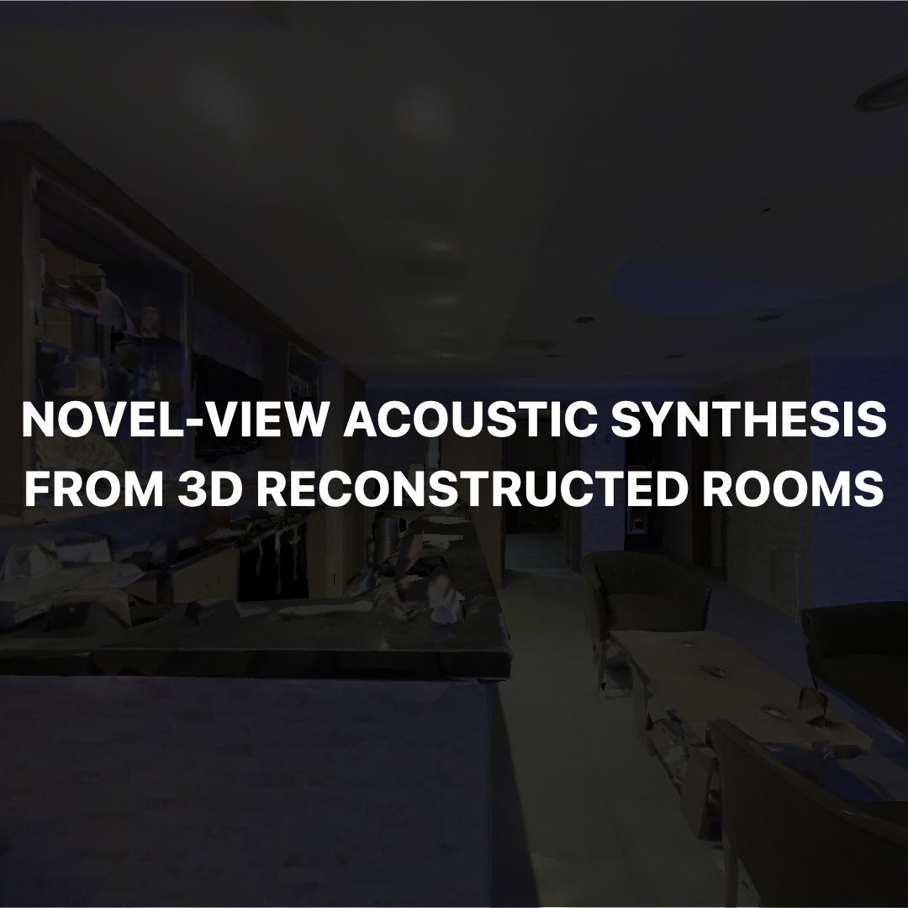

# Novel-View Acoustic Synthesis from 3D Reconstructed Rooms

[[Paper](http://arxiv.org/abs/2310.15130)] 
[[Docs](/soundspaces_nvas3d/README.md)] 
[[Demo docs](/demo/README.md)] 
[[Video1](https://docs-assets.developer.apple.com/ml-research/models/nvas/nvas3d_turn.mp4)] 
[[Video2](https://docs-assets.developer.apple.com/ml-research/models/nvas/teaser.mp4)] 


> [Click on the thumbnail image](https://docs-assets.developer.apple.com/ml-research/models/nvas/teaser.mp4) below to watch a video showcasing our Novel-View Acoustic Synthesis.
>
> 🎧 _For the optimal experience, using a headset is recommended._

<p align="center">
  <a href="https://docs-assets.developer.apple.com/ml-research/models/nvas/teaser.mp4" target="_blank"> <!-- Adjusted path -->
    
  </a>
</p>

Welcome to the official code repository for "Novel-View Acoustic Synthesis from 3D Reconstructed Rooms". 
This project estimates the sound anywhere in a scene containing multiple unknown sound sources, hence resulting in novel-view acoustic synthesis, given audio recordings from multiple microphones and the 3D geometry and material of a scene.


["Novel-View Acoustic Synthesis from 3D Reconstructed Rooms"](http://arxiv.org/abs/2310.15130)\
[Byeongjoo Ahn](https://byeongjooahn.github.io), 
[Karren Yang](https://karreny.github.io), 
[Brian Hamilton](https://www.brianhamilton.co), 
[Jonathan Sheaffer](https://www.linkedin.com/in/jsheaffer/), 
[Anurag Ranjan](https://anuragranj.github.io), 
[Miguel Sarabia](https://scholar.google.co.uk/citations?user=U2mA-EAAAAAJ&hl=en), 
[Oncel Tuzel](https://www.onceltuzel.net), 
[Jen-Hao Rick Chang](https://rick-chang.github.io)

## Directory Structure
```yaml
.
├── demo/                  # Quickstart and demo
│   ├── ...                
├── nvas3d/                # Implementation of our model
│   ├── ...                
└── soundspaces_nvas3d/    # SoundSpaces integration for NVAS3D
    ├── ...                
```

## Installation: SoundSpaces
Follow our [Step-by-Step Installation Guide](soundspaces_nvas3d/README.md) for rendering room impulse responses (RIRs) and images in Matterport3D rooms using SoundSpaces.

## Quickstart: Demo
Refer to the [Demo Guide](demo/README.md) for instructions on data generation, dry sound estimation using our model, and novel-view acoustic rendering. 

### Download the Pretrained Model
Download [our pretrained model](https://docs-assets.developer.apple.com/ml-research/models/nvas/checkpoint_200.pt) and place it in the `nvas3d/assets/saved_models/default/checkpoints/` directory.

### Launch the Demo
To get started with the full pipeline quickly:
```bash
bash demo/run_demo.sh
```

## Training
After [Training Data Generation](nvas3d/utils/training_data_generation/README.md), start the training process with:
```bash
python main.py --config ./nvas3d/config/default_config.yaml --exp default_exp
```

## Acknowledgements
We thank Dirk Schroeder and David Romblom for insightful discussions and feedback, Changan Chen for the assistance with SoundSpaces.

<!-- ## TODO (remove it before publish)
- [ ] Update the link for arXiv (line 4 in README.md)
- [x] Update the link for our pretrained model (line 50 in README.md, line 8 in demo/README.md)
- [x] Update the link for teaser video (currently from Byeongjoo's website) (lines 8 and 13 in README.md)
- [x] Update teaser video to Binaural
- [x] Add issues about headless rendering
- [x] Add script to generate training dataset
- [x] Update License and Acknowledgement with proper format
- [x] Update README to clarify optional tasks -->
